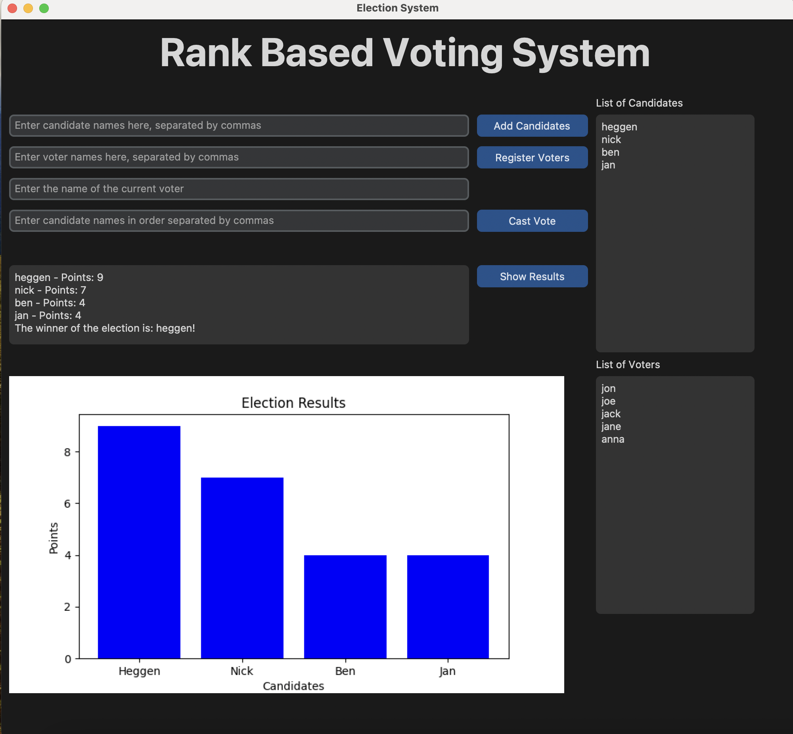

# Rank-Based Voting System

#### This project was developed as a final project for an Introduction to Python programming course. 
It implements a rank-based voting system with a modern, dark-themed graphical user interface built using customtkinter. The system allows for running elections where voters can rank candidates in order of preference, with points allocated based on ranking position. Results are displayed both textually and through an interactive bar chart visualization.

## Demonstration of the GUI


## Project Background

This application was created to demonstrate understanding of key Python programming concepts including:
- Object-oriented programming with classes and inheritance
- GUI development using modern libraries
- Data visualization
- Error handling and input validation
- File organization and modular design
- Type hints and documentation

## Project Structure

The project consists of two main files:

- `ElectionLogic.py`: Contains the core election system logic
- `RankBasedVotingSystemAndGUI.py`: Implements the graphical user interface

## Core Features

### ElectionLogic.py

The election logic implementation provides the following features:

- Candidate management (adding candidates)
- Voter registration
- Vote casting with ranking-based point allocation
- Result calculation and winner determination

#### Classes

1. `Candidate`
   - Stores candidate name and accumulated points
   - Points are initialized to 0

2. `Voter`
   - Tracks voter name and voting status
   - Prevents duplicate voting

3. `Election`
   - Manages the overall election process
   - Maintains lists of candidates and voters
   - Handles vote casting and result calculation

### Point System

The ranking system allocates points based on position:
- First choice: n-1 points (where n is the number of candidates)
- Second choice: n-2 points
- And so on, with the last choice receiving 0 points

## Running Tests

The project includes two comprehensive test suites:

1. Core Election Logic Tests:
```bash
python -m unittest test_election_logic.py
```

2. GUI Component Tests:
```bash
python -m unittest test_election_gui.py
```

To run all tests at once:
```bash
python -m unittest discover
```

The test files are organized as follows:
- `test_election_logic.py`: Tests for the core election system functionality
- `test_election_gui.py`: Tests for the GUI components and interactions

### Test Coverage

The test suite covers:
- Candidate addition
- Voter registration
- Vote casting
- Duplicate vote prevention
- Result calculation
- Error handling

## Usage Example

```python
# Create a new election
election = Election()

# Add candidates
election.add_candidates(["Alice", "Bob", "Charlie"])

# Register voters
election.register_voters(["voter1", "voter2"])

# Cast votes with rankings
election.cast_vote("voter1", ["Alice", "Bob", "Charlie"])
election.cast_vote("voter2", ["Bob", "Alice", "Charlie"])

# Get results
results = election.get_results()
print(results)
```

## Error Handling

The system includes error checking for:
- Duplicate voter registration
- Unregistered voters attempting to vote
- Duplicate voting attempts

## Dependencies

- Python 3.6 or higher
- customtkinter (for modern GUI components)
- matplotlib (for result visualization)
- dataclasses (standard library)
- typing (standard library)

The GUI is built using customtkinter, which provides a modern, dark-themed interface. Results visualization is handled by matplotlib, embedded directly in the GUI window.

## Future Improvements

Potential areas for enhancement:
- Support for write-in candidates
- Multiple election rounds
- Export results to various formats
- Database integration for persistent storage